# TÀI LIỆU TOÀN DIỆN: SƠ ĐỒ HOẠT ĐỘNG & SƠ ĐỒ TUẦN TỰ HỆ THỐNG
## HỆ THỐNG QUẢN TRỊ KHÁCH SẠN & NGHỈ DƯỠNG CAO CẤP - AURA RESORT & LUXURY VILLAS
> **Phiên bản:** 2.0 Enterprise  
> **Cập nhật:** 05/10/2026  
> **Kiến trúc:** Angular 19 (Frontend) • Spring Boot 3.x (Backend RESTful & SSE) • MySQL 8.0 • MoMo / VNPay / OnePay • Google Gemini AI

---

## MỤC LỤC TỔNG QUAN

1. [Tổng Quan Kiến Trúc & Luồng Dữ Liệu Toàn Hệ Thống](#1-tổng-quan-kiến-trúc--luồng-dữ-liệu-toàn-hệ-thống)
2. [Phân Hệ 1: Xác Thực & Quản Lý Tài Khoản (Authentication & User Management)](#phân-hệ-1-xác-thực--quản-lý-tài-khoản)
   - 1.1 Sơ Đồ Hoạt Động (Activity Diagram): Đăng Ký, Đăng Nhập & Quên Mật Khẩu OTP
   - 1.2 Sơ Đồ Tuần Tự (Sequence Diagram): Đăng Nhập & Cấp Phát JWT Token
   - 1.3 Sơ Đồ Tuần Tự (Sequence Diagram): Khôi Phục Mật Khẩu Qua Mã OTP Email
3. [Phân Hệ 2: Khám Phá & Đặt Phòng Nghỉ Dưỡng Trực Tuyến (Guest Booking)](#phân-hệ-2-khám-phá--đặt-phòng-nghỉ-dưỡng-trực-tuyến)
   - 2.1 Sơ Đồ Hoạt Động (Activity Diagram): Tìm Kiếm, Chọn Villa, Giữ Chỗ & Đặt Phòng
   - 2.2 Sơ Đồ Tuần Tự (Sequence Diagram): Khách Tạo Đơn Đặt Phòng Trực Tuyến
4. [Phân Hệ 3: Cổng Thanh Toán MoMo / VNPay & Xử Lý Webhook IPN](#phân-hệ-3-cổng-thanh-toán-momo--vnpay--xử-lý-webhook-ipn)
   - 3.1 Sơ Đồ Hoạt Động (Activity Diagram): Thanh Toán Trực Tuyến & Đối Soát Đơn
   - 3.2 Sơ Đồ Tuần Tự (Sequence Diagram): Tạo Link Thanh Toán & Nhận Webhook IPN Realtime
5. [Phân Hệ 4: Trợ Lý Ảo AI Concierge Tư Vấn Nghỉ Dưỡng](#phân-hệ-4-trợ-lý-ảo-ai-concierge-tư-vấn-nghỉ-dưỡng)
   - 4.1 Sơ Đồ Hoạt Động (Activity Diagram): AI Hỏi Đáp & Đề Xuất Villa Thông Minh
   - 4.2 Sơ Đồ Tuần Tự (Sequence Diagram): Luồng Xử Lý Prompt & Trả Lời Gợi Ý Biệt Thự
6. [Phân Hệ 5: Nghiệp Vụ Lễ Tân - Check-in, Check-out & Đặt Trực Tiếp Tại Quầy](#phân-hệ-5-nghiệp-vụ-lễ-tân---check-in-check-out--đặt-trực-tiếp-tại-quầy)
   - 5.1 Sơ Đồ Hoạt Động (Activity Diagram): Quy Trình Tiếp Đón Check-in & Trả Phòng Check-out
   - 5.2 Sơ Đồ Tuần Tự (Sequence Diagram): Tiếp Nhận Check-in Đơn Phòng Có Sẵn
   - 5.3 Sơ Đồ Tuần Tự (Sequence Diagram): Trả Phòng (Check-out) & Kích Hoạt Dọn Dẹp
   - 5.4 Sơ Đồ Tuần Tự (Sequence Diagram): Tạo Đơn Đặt Trực Tiếp Tại Quầy (Walk-in Booking)
7. [Phân Hệ 6: Quản Trị Buồng Phòng, Quy Trình Dọn 16 Bước & Mobile Portal](#phân-hệ-6-quản-trị-buồng-phòng-quy-trình-dọn-16-bước--mobile-portal)
   - 6.1 Sơ Đồ Hoạt Động (Activity Diagram): Vòng Đời Buồng Phòng (Cleaning Lifecycle)
   - 6.2 Sơ Đồ Tuần Tự (Sequence Diagram): Nhân Viên Thao Tác Mobile Portal & Nghiệm Thu QC
8. [Phân Hệ 7: Kiểm Kê Minibar, Bổ Sung Kho & Đối Soát Hóa Đơn](#phân-hệ-7-kiểm-kê-minibar-bổ-sung-kho--đối-soát-hóa-đơn)
   - 7.1 Sơ Đồ Hoạt Động (Activity Diagram): Ghi Nhận Tiêu Thụ, Bổ Sung & Tính Hóa Đơn
   - 7.2 Sơ Đồ Tuần Tự (Sequence Diagram): Buồng Phòng Báo Tiêu Thụ -> Kế Toán Đối Soát Chốt Bill
9. [Phân Hệ 8: Điều Phối Phương Tiện VIP & Dịch Vụ Độc Bản](#phân-hệ-8-điều-phối-phương-tiện-vip--dịch-vụ-độc-bản)
   - 8.1 Sơ Đồ Hoạt Động (Activity Diagram): Đón Tiễn Maybach, Du Thuyền & Trực Thăng
   - 8.2 Sơ Đồ Tuần Tự (Sequence Diagram): Lập Lệnh Điều Phối & Bàn Giao Quản Gia Butler
10. [Phân Hệ 9: Đánh Giá CSAT, NPS & Quy Trình Cứu Vãn Khiếu Nại Dưới 3 Phút](#phân-hệ-9-đánh-giá-csat-nps--quy-trình-cứu-vãn-khiếu-nại)
    - 9.1 Sơ Đồ Hoạt Động (Activity Diagram): Thu Thập Đánh Giá & Kích Hoạt Ticket Khẩn Cấp
    - 9.2 Sơ Đồ Tuần Tự (Sequence Diagram): Gửi Đánh Giá -> Báo Động Khiếu Nại -> Xử Lý SLA < 3 Phút
11. [Phân Hệ 10: Xếp Ca Trực 24/7, Đổi Ca & Khóa Sổ Kế Toán Cuối Ngày (Night Audit)](#phân-hệ-10-xếp-ca-trực-247-đổi-ca--khóa-sổ-cuối-ngày)
    - 10.1 Sơ Đồ Hoạt Động (Activity Diagram): Xếp Lịch, Đổi Ca & Khóa Sổ Cuối Ngày
    - 10.2 Sơ Đồ Tuần Tự (Sequence Diagram): Yêu Cầu Đổi Ca & Quản Lý Phê Duyệt
    - 10.3 Sơ Đồ Tuần Tự (Sequence Diagram): Quy Trình Kiểm Toán Đêm & Khóa Sổ Đối Soát (Night Audit)

---

## 1. TỔNG QUAN KIẾN TRÚC & LUỒNG DỮ LIỆU TOÀN HỆ THỐNG

Hệ thống được thiết kế theo mô hình phân tầng hướng dịch vụ hiện đại:
- **Tầng Client / Presentation:** Khách hàng (Website SPA, Mobile responsive), Nhân viên buồng phòng (Mobile Web Portal), Bộ phận Lễ tân & Quản trị (Admin Backoffice SPA).
- **Tầng API Gateway / Controller:** Spring Boot REST Controllers (`/api/v1/*`), Spring Security JWT Filter, SSE Emitter (`/notifications/stream`).
- **Tầng Business Logic & Service:** Xử lý toàn bộ logic nghiệp vụ lưu trú, tính giá động, khóa giữ phòng, điều phối dịch vụ, kiểm toán sổ cái kép.
- **Tầng Data & Integration:** MySQL Database (JPA/Hibernate), MoMo/VNPay API, Cloudinary Storage, SMTP Mail Server, Google Gemini AI Engine.

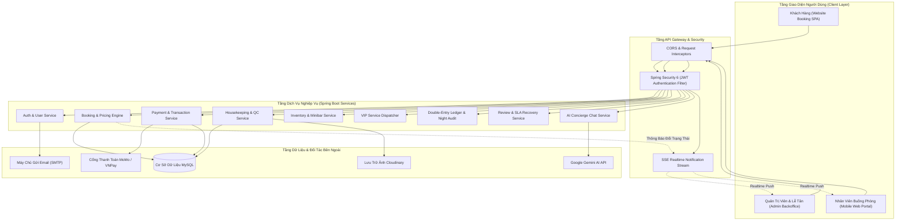

---

## PHÂN HỆ 1: XÁC THỰC & QUẢN LÝ TÀI KHOẢN

### 1.1 Sơ Đồ Hoạt Động (Activity Diagram): Đăng Ký, Đăng Nhập & Quên Mật Khẩu OTP

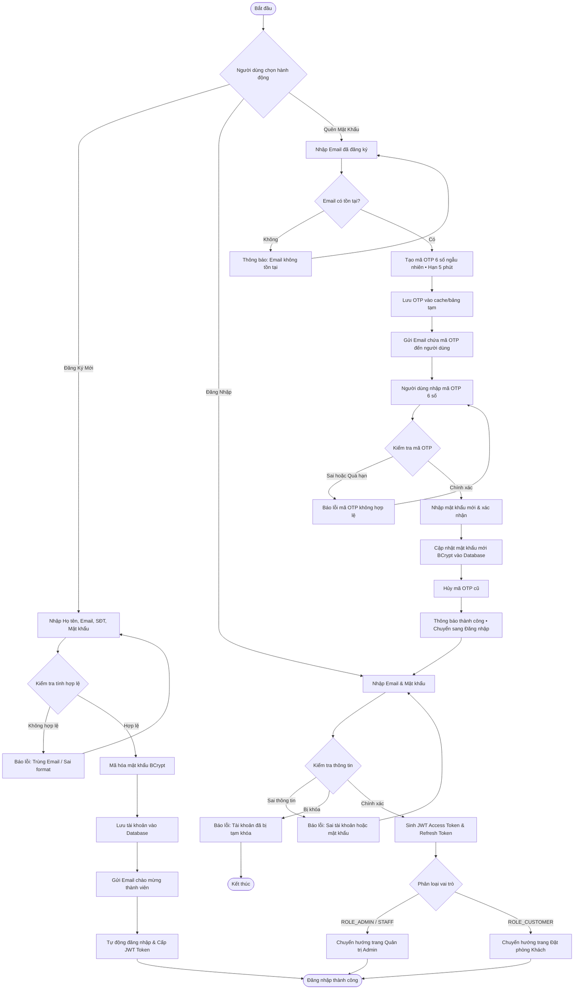

### 1.2 Sơ Đồ Tuần Tự (Sequence Diagram): Đăng Nhập & Cấp Phát JWT Token

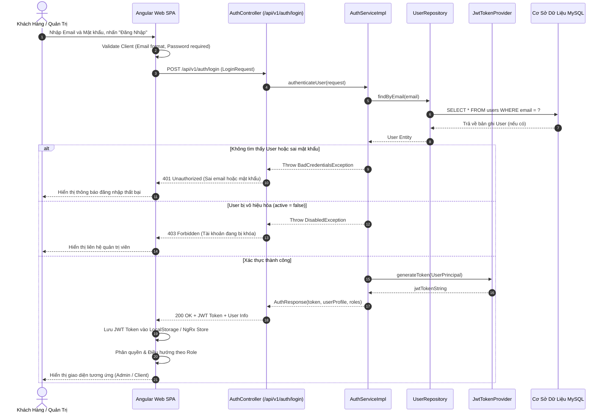

### 1.3 Sơ Đồ Tuần Tự (Sequence Diagram): Khôi Phục Mật Khẩu Qua Mã OTP Email

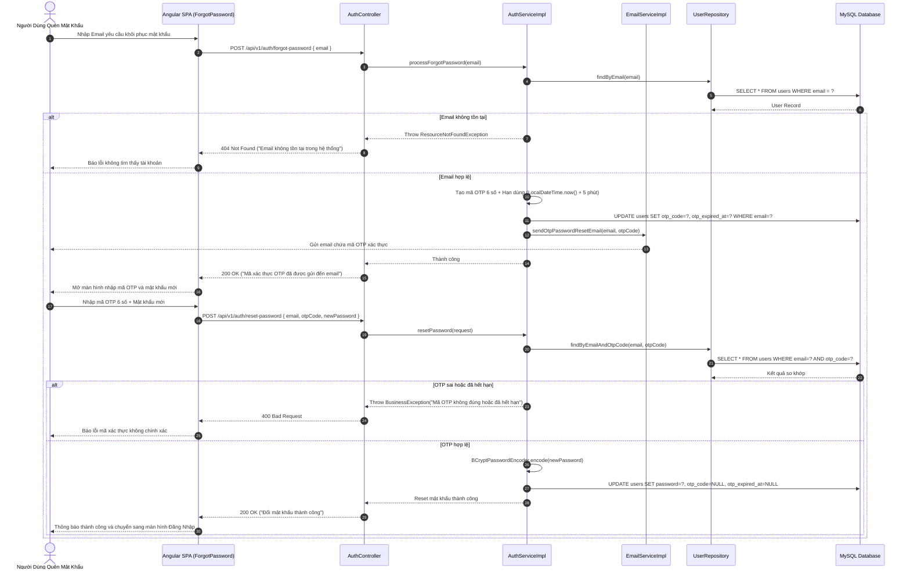

---

## PHÂN HỆ 2: KHÁM PHÁ & ĐẶT PHÒNG NGHỈ DƯỠNG TRỰC TUYẾN

### 2.1 Sơ Đồ Hoạt Động (Activity Diagram): Tìm Kiếm, Chọn Villa, Giữ Chỗ & Đặt Phòng

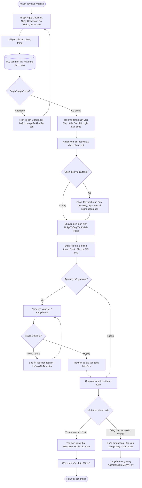

### 2.2 Sơ Đồ Tuần Tự (Sequence Diagram): Khách Tạo Đơn Đặt Phòng Trực Tuyến

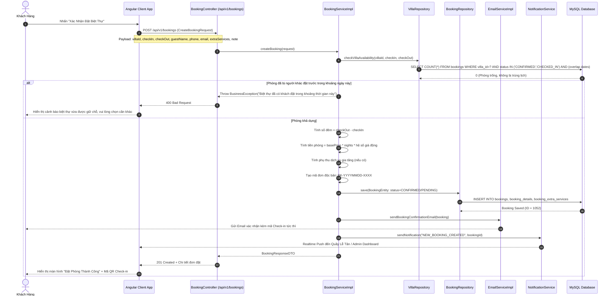

---

## PHÂN HỆ 3: CỔNG THANH TOÁN MOMO / VNPAY & XỬ LÝ WEBHOOK IPN

### 3.1 Sơ Đồ Hoạt Động (Activity Diagram): Thanh Toán Trực Tuyến & Đối Soát Đơn

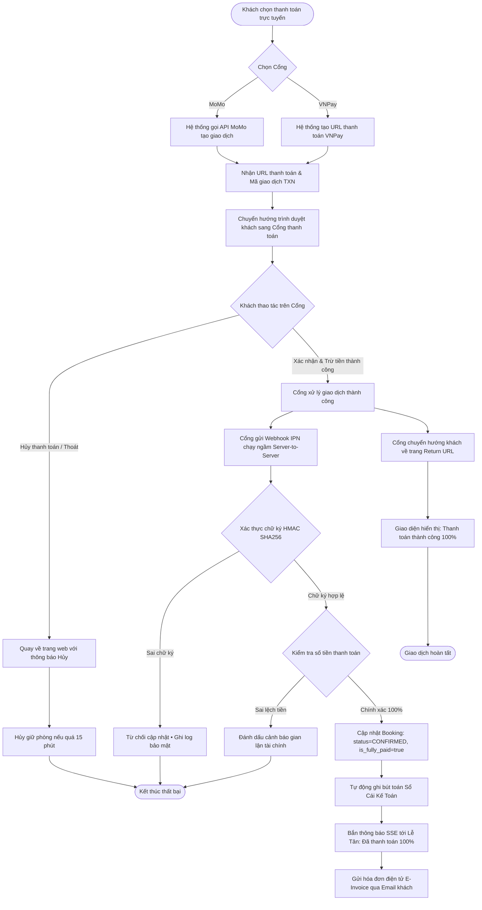

### 3.2 Sơ Đồ Tuần Tự (Sequence Diagram): Tạo Link Thanh Toán & Nhận Webhook IPN Realtime

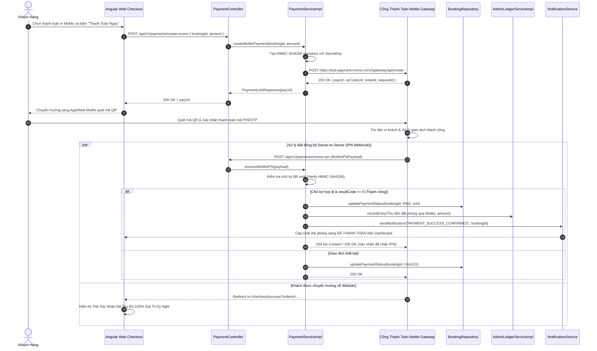

---

## PHÂN HỆ 4: TRỢ LÝ ẢO AI CONCIERGE TƯ VẤN NGHỈ DƯỠNG

### 4.1 Sơ Đồ Hoạt Động (Activity Diagram): AI Hỏi Đáp & Đề Xuất Villa Thông Minh

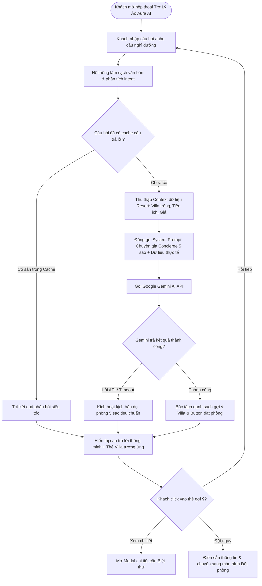

### 4.2 Sơ Đồ Tuần Tự (Sequence Diagram): Luồng Xử Lý Prompt & Trả Lời Gợi Ý Biệt Thự

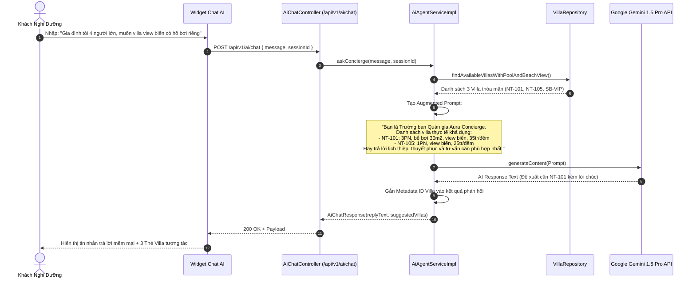

---

## PHÂN HỆ 5: NGHIỆP VỤ LỄ TÂN - CHECK-IN, CHECK-OUT & ĐẶT TRỰC TIẾP TẠI QUẦY

### 5.1 Sơ Đồ Hoạt Động (Activity Diagram): Quy Trình Tiếp Đón Check-in & Trả Phòng Check-out

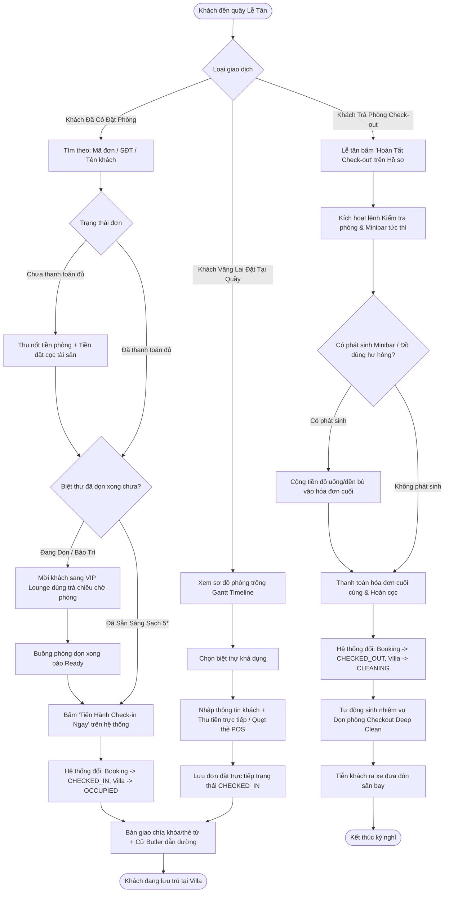

### 5.2 Sơ Đồ Tuần Tự (Sequence Diagram): Tiếp Nhận Check-in Đơn Phòng Có Sẵn

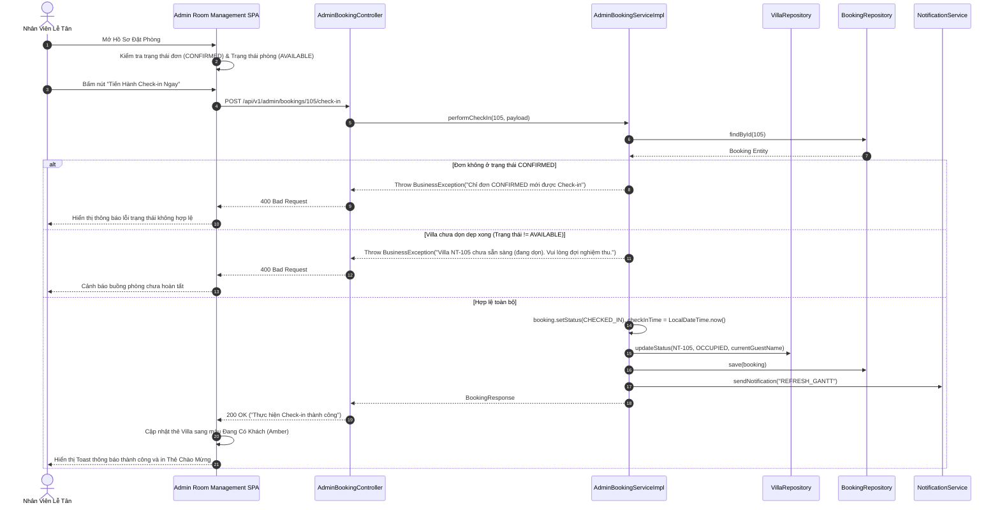

### 5.3 Sơ Đồ Tuần Tự (Sequence Diagram): Trả Phòng (Check-out) & Kích Hoạt Dọn Dẹp

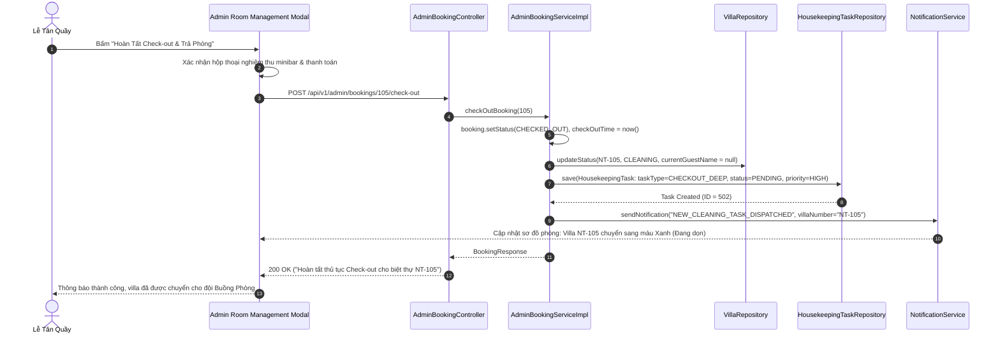

---

## PHÂN HỆ 6: QUẢN TRỊ BUỒNG PHÒNG, QUY TRÌNH DỌN 16 BƯỚC & MOBILE PORTAL

### 6.1 Sơ Đồ Hoạt Động (Activity Diagram): Vòng Đời Buồng Phòng (Cleaning Lifecycle)

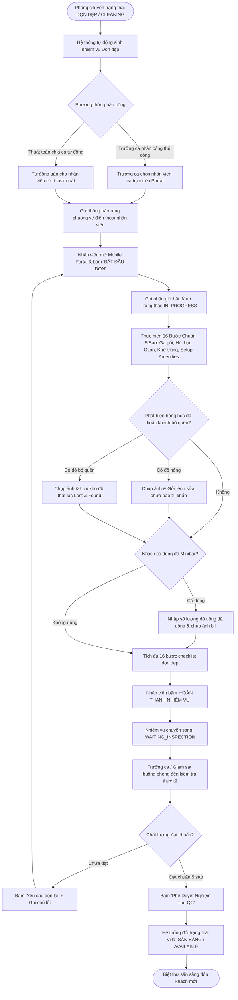

### 6.2 Sơ Đồ Tuần Tự (Sequence Diagram): Nhân Viên Thao Tác Mobile Portal & Nghiệm Thu QC

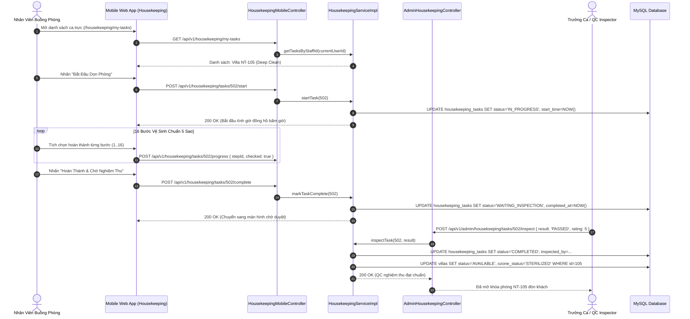

---

## PHÂN HỆ 7: KIỂM KÊ MINIBAR, BỔ SUNG KHO & ĐỐI SOÁT HÓA ĐƠN

### 7.1 Sơ Đồ Hoạt Động (Activity Diagram): Ghi Nhận Tiêu Thụ, Bổ Sung & Tính Hóa Đơn

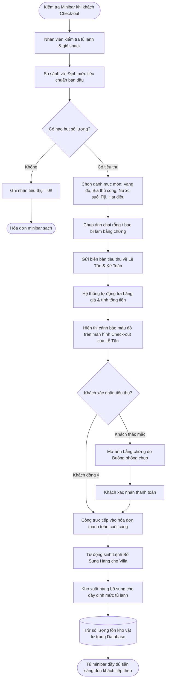

### 7.2 Sơ Đồ Tuần Tự (Sequence Diagram): Buồng Phòng Báo Tiêu Thụ -> Kế Toán Đối Soát Chốt Bill

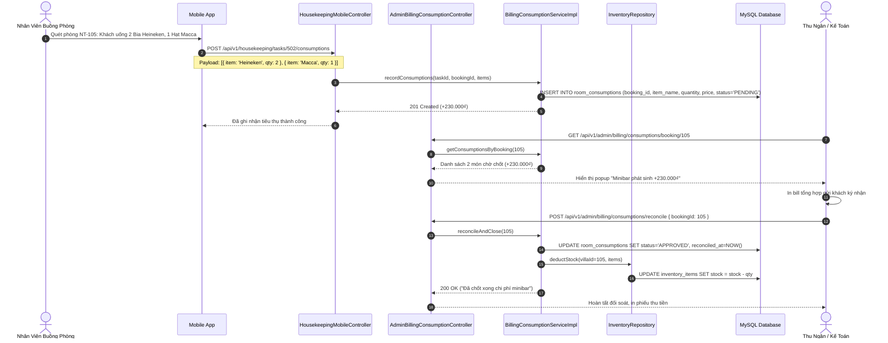

---

## PHÂN HỆ 8: ĐIỀU PHỐI PHƯƠNG TIỆN VIP & DỊCH VỤ ĐỘC BẢN

### 8.1 Sơ Đồ Hoạt Động (Activity Diagram): Đón Tiễn Maybach, Du Thuyền & Trực Thăng

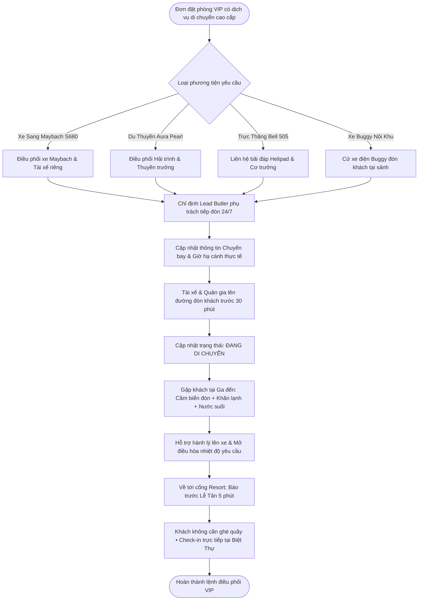

### 8.2 Sơ Đồ Tuần Tự (Sequence Diagram): Lập Lệnh Điều Phối & Bàn Giao Quản Gia Butler

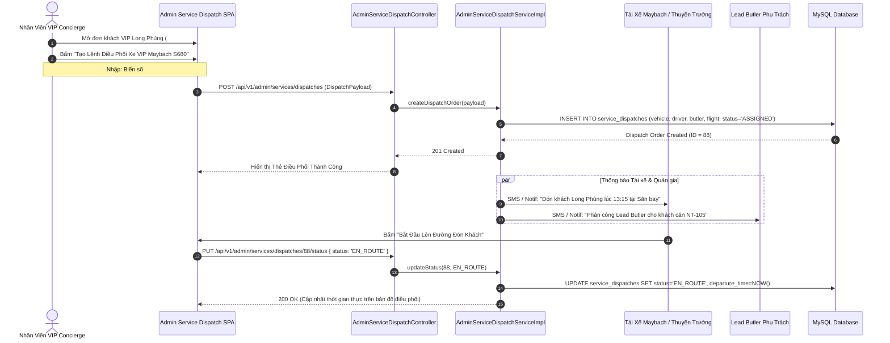

---

## PHÂN HỆ 9: ĐÁNH GIÁ CSAT, NPS & QUY TRÌNH CỨU VÃN KHIẾU NẠI

### 9.1 Sơ Đồ Hoạt Động (Activity Diagram): Thu Thập Đánh Giá & Kích Hoạt Ticket Khẩn Cấp

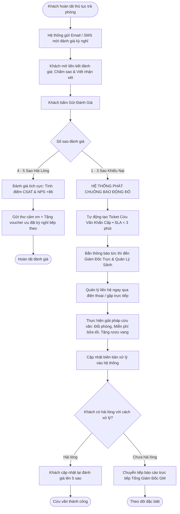

### 9.2 Sơ Đồ Tuần Tự (Sequence Diagram): Gửi Đánh Giá -> Báo Động Khiếu Nại -> Xử Lý SLA < 3 Phút

```mermaid
sequenceDiagram
    autonumber
    actor Guest as Khách Hàng
    participant ReviewUI as Angular Review Component
    participant RevCtrl as ReviewController
    participant RevSvc as ReviewServiceImpl
    participant RecoveryCtrl as AdminReviewRecoveryController
    participant SSE as NotificationService
    actor DutyManager as Giám Đốc Trực Ca (Duty Manager)
    participant DB as MySQL Database

    Guest->>ReviewUI: Chấm 2 Sao + Nhận xét: "Điều hòa phòng khách kêu to lúc nửa đêm"
    ReviewUI->>RevCtrl: POST /api/v1/reviews { bookingId, rating: 2, comment: "..." }
    RevCtrl->>RevSvc: saveReview(dto)
    RevSvc->>DB: INSERT INTO reviews (rating=2, comment=..., status='FLAGGED')

    RevSvc->>RevSvc: Phát hiện rating <= 3: Kích hoạt Trigger Khẩn Cấp
    RevSvc->>DB: INSERT INTO recovery_tickets (review_id, sla_minutes=3, status='OPEN')
    RevSvc->>SSE: sendUrgentAlert("CSAT_EMERGENCY_ALERT", "Khách căn NT-105 chấm 2 sao")
    
    SSE-->>DutyManager: Chuông báo động reo trên màn hình Admin kèm đếm ngược 03:00

    DutyManager->>DutyManager: Bấm mở Ticket & Xem số điện thoại khách hàng (+84 918 223 999)
    DutyManager->>Guest: Gọi điện thoại xin lỗi trong vòng 90 giây & cử Kỹ thuật đến kiểm tra
    Note over DutyManager,Guest: Tặng miễn phí bữa tối hải sản BBQ bãi biển trị giá 3.500.000₫

    DutyManager->>RecoveryCtrl: PUT /api/v1/admin/reviews/recovery-tickets/45 { resolution: "Đã xử lý điều hòa và tặng BBQ", guestSatisfied: true }
    RecoveryCtrl->>DB: UPDATE recovery_tickets SET status='RESOLVED', resolved_at=NOW()
    RecoveryCtrl-->>DutyManager: 200 OK ("Ticket đã được đóng thành công trong 2 phút 15 giây")
```

---

## PHÂN HỆ 10: XẾP CA TRỰC 24/7, ĐỔI CA & KHÓA SỔ CUỐI NGÀY

### 10.1 Sơ Đồ Hoạt Động (Activity Diagram): Xếp Lịch, Đổi Ca & Khóa Sổ Cuối Ngày

```mermaid
flowchart TD
    Start([Vận hành nhân sự & Kế toán]) --> SubProcess{Quy trình nghiệp vụ}

    %% Xếp ca & Đổi ca
    SubProcess -->|Quản Lý Nhân Sự & Ca Trực| RosterView[Xem ma trận phân ca: Ca Sáng 06-14h, Chiều 14-22h, Đêm 22-06h]
    RosterView --> StaffRequest{Nhân viên cần đổi ca?}
    StaffRequest -->|Có nhu cầu| SubmitSwap[Gửi yêu cầu đổi ca trực trên hệ thống]
    SubmitSwap --> ManagerReview{Trưởng ca phê duyệt?}
    ManagerReview -->|Từ chối| RejectSwap[Thông báo từ chối kèm lý do thiếu người] --> RosterView
    ManagerReview -->|Đồng ý| ApproveSwap[Hệ thống tự động hoán đổi lịch trực giữa 2 nhân sự] --> UpdateRoster[Cập nhật bảng chấm công thời gian thực]

    %% Khóa sổ cuối ngày Night Audit
    SubProcess -->|Kiểm Toán Đêm Night Audit| NightAuditStart[00:00 - Kế toán viên chạy quy trình Night Audit]
    NightAuditStart --> Step1[1. Quét đối soát toàn bộ tiền phòng và minibar trong ngày]
    Step1 --> Step2[2. Khớp tiền mặt tại két với sao kê ngân hàng MoMo, VNPay, POS quẹt thẻ]
    Step2 --> DiscrepancyCheck{Có phát sinh chênh lệch số dư?}

    DiscrepancyCheck -->|Có chênh lệch| AuditAlert[Đánh dấu bút toán bất thường • Yêu cầu thu ngân giải trình] --> ManualFix[Kế toán trưởng duyệt xử lý điều chỉnh] --> Step3
    DiscrepancyCheck -->|Khớp 100%| Step3[3. Tự động chuyển toàn bộ doanh thu vào Sổ Cái Kép]

    Step3 --> Step4[4. Chốt số dư cuối ngày & Khóa cổng chỉnh sửa hóa đơn cũ]
    Step4 --> ExportReport[5. Tự động xuất Báo cáo Tài chính CSV/PDF gửi Ban Giám Đốc]
    ExportReport --> EndDayClosing([Hoàn tất khóa sổ - Khởi tạo ngày kinh doanh mới])
```

### 10.2 Sơ Đồ Tuần Tự (Sequence Diagram): Yêu Cầu Đổi Ca & Quản Lý Phê Duyệt

```mermaid
sequenceDiagram
    autonumber
    actor StaffA as Nhân Viên A (Phạm Văn Minh)
    actor StaffB as Nhân Viên B (Long Phùng)
    participant StaffUI as Portal Nhân Sự
    participant StaffCtrl as AdminStaffController
    participant StaffSvc as AdminStaffServiceImpl
    actor Manager as Quản Lý Ca Trực
    participant DB as MySQL Database

    StaffA->>StaffUI: Tạo yêu cầu đổi ca: Muốn đổi Ca Sáng ngày 06/10 với Nhân viên B
    StaffUI->>StaffCtrl: POST /api/v1/admin/staff/swap-requests { targetStaffId: B, targetShiftId: 102 }
    StaffCtrl->>StaffSvc: requestShiftSwap(payload)
    StaffSvc->>DB: INSERT INTO shift_swap_requests (from_user, to_user, status='PENDING_PEER')
    StaffSvc-->>StaffB: Gửi thông báo: "Bạn có yêu cầu đổi ca từ Phạm Văn Minh"

    StaffB->>StaffUI: Bấm "Đồng ý hoán đổi"
    StaffUI->>StaffCtrl: PUT /api/v1/admin/staff/swap-requests/12/peer-accept
    StaffCtrl->>StaffSvc: peerAccept(12)
    StaffSvc->>DB: UPDATE shift_swap_requests SET status='PENDING_MANAGER'
    StaffSvc-->>Manager: Bắn thông báo: "Chờ Quản lý duyệt đổi ca giữa Minh và Long"

    Manager->>StaffUI: Mở danh sách duyệt đổi ca & bấm "PHÊ DUYỆT"
    StaffUI->>StaffCtrl: POST /api/v1/admin/staff/swap-requests/12/approve
    StaffCtrl->>StaffSvc: approveShiftSwap(12)
    StaffSvc->>DB: UPDATE staff_schedules SET user_id=B WHERE shift_id=101
    StaffSvc->>DB: UPDATE staff_schedules SET user_id=A WHERE shift_id=102
    StaffSvc->>DB: UPDATE shift_swap_requests SET status='APPROVED'
    StaffSvc-->>StaffCtrl: 200 OK ("Hoán đổi ca trực thành công")
    StaffCtrl-->>StaffUI: Cập nhật Lịch Roster mới ngay lập tức
```

### 10.3 Sơ Đồ Tuần Tự (Sequence Diagram): Quy Trình Kiểm Toán Đêm & Khóa Sổ Đối Soát (Night Audit)

```mermaid
sequenceDiagram
    autonumber
    actor Auditor as Kiểm Toán Viên Đêm / Kế Toán
    participant AuditUI as Màn Hình Sổ Cái & Báo Cáo
    participant LedgerCtrl as AdminLedgerController
    participant LedgerSvc as AdminLedgerServiceImpl
    participant PaymentRepo as PaymentRepository
    participant DB as MySQL Database

    Auditor->>AuditUI: Chọn ngày làm việc và nhấn "Khởi Chạy Kiểm Toán Đêm (Day-End Closing)"
    AuditUI->>LedgerCtrl: POST /api/v1/admin/payments/day-end-closing { date: '2026-10-05' }
    LedgerCtrl->>LedgerSvc: executeNightAudit(date)

    LedgerSvc->>PaymentRepo: aggregateDailyRevenue(date)
    PaymentRepo->>DB: SELECT payment_method, SUM(amount) FROM payments WHERE DATE(created_at) = ? GROUP BY payment_method
    DB-->>PaymentRepo: [VNPay: 120M, MoMo: 85M, Tiền mặt: 45.5M, POS: 0M]

    LedgerSvc->>LedgerSvc: So khớp với dữ liệu Sổ Cái Kép (Debit / Credit)
    LedgerSvc->>DB: INSERT INTO ledger_entries (account='REVENUE_ROOM', type='CREDIT', amount=250500000)
    LedgerSvc->>DB: INSERT INTO daily_closing_audits (closing_date=?, total_revenue=250500000, status='LOCKED')
    
    LedgerSvc->>LedgerSvc: Đóng sổ ngày 05/10/2026 • Khóa quyền sửa các hóa đơn phát sinh trước đó
    LedgerSvc-->>LedgerCtrl: NightAuditSummary(totalVillas=16, occupancyRate=88%, totalRevenue=250500000)
    LedgerCtrl-->>AuditUI: 200 OK + Biên Bản Kiểm Toán Đêm Thành Công
    AuditUI-->>Auditor: Hiển thị báo cáo tài chính chốt ngày + Xuất file PDF/Excel hoàn tất
```

---

## BẢNG TỔNG HỢP MÃ API VÀ CHỨC NĂNG TƯƠNG ỨNG

| STT | Nhóm Nghiệp Vụ | API Endpoint Chính | HTTP Method | Chức Năng Cốt Lõi |
| :--- | :--- | :--- | :--- | :--- |
| **1** | Xác Thực | `/api/v1/auth/login` | `POST` | Đăng nhập cấp phát JWT Access Token |
| **2** | Xác Thực | `/api/v1/auth/register` | `POST` | Đăng ký tài khoản khách hàng mới |
| **3** | Xác Thực | `/api/v1/auth/forgot-password` | `POST` | Gửi mã OTP 6 số khôi phục mật khẩu qua Email |
| **4** | Đặt Phòng | `/api/v1/public/villas` | `GET` | Tìm kiếm biệt thự theo ngày lưu trú và số khách |
| **5** | Đặt Phòng | `/api/v1/bookings` | `POST` | Khởi tạo đơn đặt phòng trực tuyến |
| **6** | Thanh Toán | `/api/v1/payments/create-momo` | `POST` | Khởi tạo liên kết thanh toán MoMo QR / Thẻ |
| **7** | Thanh Toán | `/api/v1/payments/momo-ipn` | `POST` | Webhook IPN nhận kết quả thanh toán tự động |
| **8** | AI Concierge | `/api/v1/ai/chat` | `POST` | Trợ lý ảo AI tư vấn chọn phòng & dịch vụ |
| **9** | Lễ Tân | `/api/v1/admin/bookings/direct` | `POST` | Tạo đơn đặt phòng trực tiếp tại quầy |
| **10** | Lễ Tân | `/api/v1/admin/bookings/{id}/check-in` | `POST` | Thực hiện thủ tục nhận phòng (Check-in) |
| **11** | Lễ Tân | `/api/v1/admin/bookings/{id}/check-out` | `POST` | Hoàn tất thủ tục trả phòng (Check-out) |
| **12** | Buồng Phòng | `/api/v1/housekeeping/my-tasks` | `GET` | Lấy danh sách phòng phân công ca trực di động |
| **13** | Buồng Phòng | `/api/v1/housekeeping/tasks/{id}/progress` | `POST` | Cập nhật tiến độ 16 bước checklist buồng phòng |
| **14** | Buồng Phòng | `/api/v1/admin/housekeeping/tasks/{id}/inspect` | `POST` | Giám sát viên phê duyệt nghiệm thu chất lượng QC |
| **15** | Minibar & Kho | `/api/v1/housekeeping/tasks/{id}/consumptions` | `POST` | Báo cáo đồ uống minibar khách đã sử dụng |
| **16** | Minibar & Kho | `/api/v1/admin/billing/consumptions/{id}/reconcile` | `POST` | Kế toán đối soát và chốt hóa đơn minibar |
| **17** | VIP Concierge| `/api/v1/admin/services/dispatches` | `POST` | Lập lệnh điều phối xe Maybach, Du thuyền, Buggy |
| **18** | Đánh Giá & CSAT| `/api/v1/reviews` | `POST` | Khách gửi đánh giá chấm sao và nhận xét |
| **19** | Đánh Giá & CSAT| `/api/v1/admin/reviews/recovery-tickets` | `POST` | Kích hoạt ticket cứu vãn khẩn cấp SLA < 3 phút |
| **20** | Nhân Sự & Ca | `/api/v1/admin/staff/swap-requests/{id}/approve` | `POST` | Quản lý phê duyệt yêu cầu đổi ca trực |
| **21** | Kế Toán Sổ Cái | `/api/v1/admin/payments/day-end-closing` | `POST` | Kiểm toán đêm và khóa sổ đối soát cuối ngày |

---

> **Ghi Chú Triển Khai & Kiểm Thử:**  
> Toàn bộ các sơ đồ Mermaid trong tài liệu này tuân thủ cú pháp chuẩn quốc tế, có thể hiển thị trực tiếp trên Visual Studio Code (Markdown Preview Mermaid Support), GitHub Markdown, Notion hoặc sao chép vào [Mermaid Live Editor](https://mermaid.live) để kết xuất dưới dạng ảnh SVG/PNG vector độ phân giải cao phục vụ thuyết trình hoặc báo cáo kiến trúc hệ thống.
